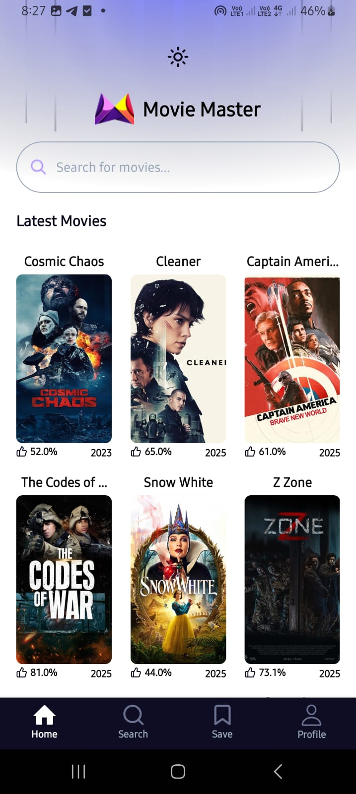
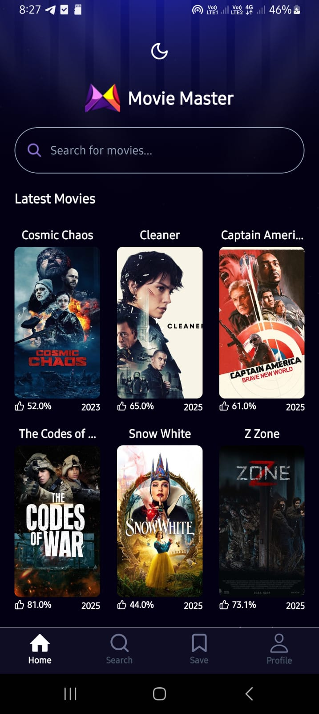

<h1 align="center"> 🎬 Movie Master </h1>

🚀 **Movie Master** adalah aplikasi **React Native** untuk menemukan dan menjelajahi film terbaru dengan fitur **Dark Mode**, **Light Mode**, dan **Movie Search**.

---

## 📌 Tech Stack


---

## 📖 Table of Contents

- [📌 Tech Stack](#-tech-stack)
- [✨ Features](#-features)
- [📦 Installation](#-installation)
- [🚀 Usage](#-usage)
- [📷 Screenshots](#-screenshots)
- [👤 Author](#-author)

---

## ✨ Features

✅ **Latest Movies** – Dapatkan daftar film terbaru yang sedang trending 📅🎥
✅ **Dark Mode & Light Mode** – Mode tampilan yang nyaman di mata 🌙☀️
✅ **Search Movie** – Cari film favoritmu dengan mudah 🔍🎬

---

## 📦 Installation

```sh
# Clone repository
git clone https://github.com/ifwhy/movie-master.git
cd movie-master

# Install dependencies
npm install
```

---

## 🚀 Usage

```sh
# Jalankan aplikasi di emulator / device
npm run start
```

Pastikan **Android Emulator** atau **Xcode Simulator** sudah siap sebelum menjalankan perintah di atas.

---

## 📷 Screenshots

<div align="center">
  <table>
    <tr>
      <th align="center">Light Mode ☀️</th>
      <th align="center">Dark Mode 🌙</th>
    </tr>
    <tr>
      <td></td>
      <td></td>
    </tr>
  </table>
</div>

---

## 👤 Author

Made with ❤️ by **Ivan Wahyu Nugroho**

---

🎬 **Movie Master** – Your ultimate movie discovery app! 🚀

⚡ **Note:** Project ini masih dalam pengembangan dan akan terus diperbarui dengan fitur-fitur baru di masa mendatang! Stay tuned! 🚀
